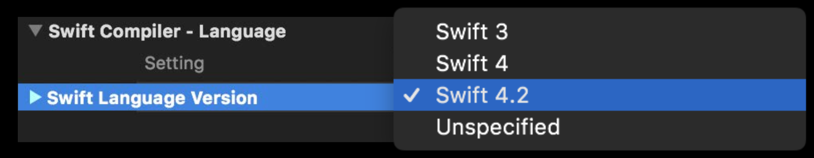
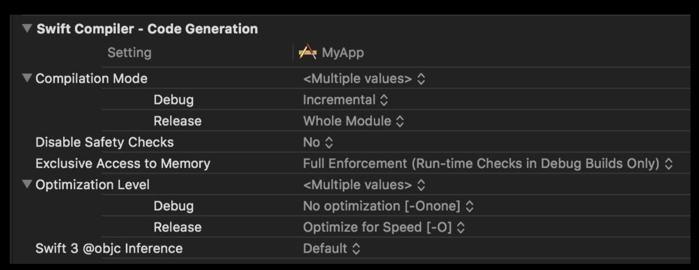
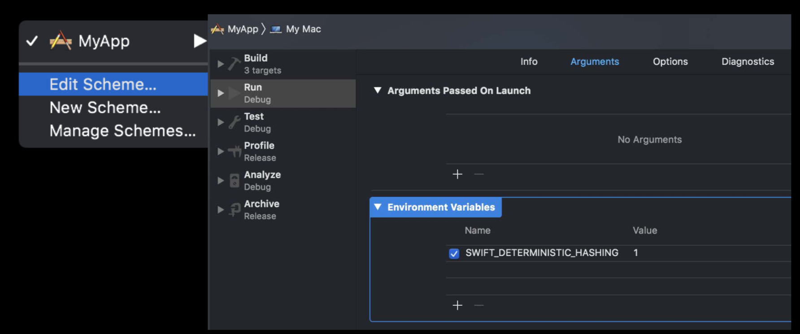
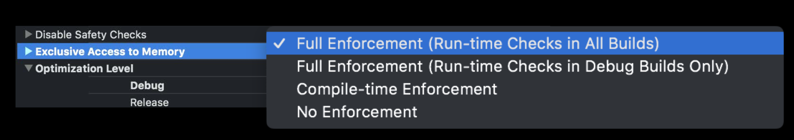

# Whats new in Swift

#### What is Swift 4.2? 

Swift 4.2는 Swift 4.1 및 4.0에 대한 주요 업데이트입니다. 

Swift 4.2에서 주요한 변화는 4가지 입니다.

+ 프로젝트 빌드 속도 개선
+ boilerplate를 제거하는 것을 목표로 언어 개선에 집중
+ Objective-C API가 Swift에 더 잘 조화되도록 노력하고, API사용을 개선
+ 2019년 초에 발표될 Swift5에서 대두되는 binary compatibility을 위한 런타임 변경

> Definition

```
binary compatibility
- A Library is binary compatibility, if a program linked dynamically to a former version of the library continues running with newer versions of the library without the need to recompile
(재컴파일 할 필요 없이 이전 버전의 라이브러리에서 새 버전의 라이브러리를 동적으로 연결할 수 있다면, 그 라이브러리는 binary compatibility이 있다고 함)
```


#### Source Compatibility

Xcode 10을 사용하고 있다면 Swift 4.2를 사용하고있는 것입니다. 

Xcode 9에서와 마찬가지로 컴파일러는 multiple language compatibility mode를 지원합니다. 



편집 메뉴에서 Migrator Support는 변경 사항을 기계적으로 변환해주는 기능을 제공합니다. 하지만 Swift4.2로 일찍 마이그레이션하면 나중에 약간의 변경이있을 것으로 예상됩니다. Xcode 10 beta SDK가 추가로 개선 될 것이기 때문입니다.

Xcode 10이 Swift 3 호환 모드를 지원하는 마지막 릴리즈가 될 것이기 때문에 모든 사람들이 스위프트 3에서 벗어나 스위프트 4.2를 사용하는 것이 중요하다고 생각합니다.

> Definition

```
Source Compatibility
- If a program needs to be recompiled to run with a new version of library but doesn't require any further modifications, the library is source compatibility
(만약 재컴파일은 필요로 하지만, 어떠한 수정 없이도 새 버전의 라이브러리를 만들어서 실행할 수 있다면, 그 라이브러리는 소스 호환성이 있다고 합니다.)
```


#### Faster Swift Debug Builds 

Swift에서 Objective-C를 혼합한 project를 테스트 한 결과 3배 빠르게 빌드됩니다. (개발 환경: 4-Core MacBook Pro i7)

물론 빌드시간은 프로젝트의 성격, 사용중인 스위프트 코드의 양, 시스템의 코어 수에 따라 달라 지지만 실제로는 많은 프로젝트에서 2 배의 속도 향상을 보입니다.

이러한 개선은 컴파일러가 수행하는 많은 중복 작업제거와 헤더 파일이 필요없는 Swift의 뛰어난 기능, 코어를보다 잘 활용할 수 있도록 컴파일 파이프 라인을 수정한 결과물입니다.

또한 디버그 빌드는 크게 변화하여, 컴파일 모드를 최적화 수준에서 분리했습니다. 



디버그 빌드의 경우 기본값은 incremental입니다. 즉, 모든 파일이 모두 빌드되고 항상 함께 다시 빌드되지는 않습니다. 

따라서 rebuild 시간에 이점이 예상됩니다.

결론적으로 Xcode 10에서 디버그 빌드의 incremental + no optimization 조합이 개발과정에서 build 시간을 줄여 생산성을 높여줄 것으로 


#### Runtime Optimizations 

Swift는 자동 메모리 관리를 사용하며 객체 인스턴스를 관리하기 위해 Objective-C와 같은 참조 카운팅을 사용합니다.

아래 코드는 예제 코드입니다.

```swift
// Calling Convention "Owned" (+1 retain)
class X { }

func caller() {
    // 'X' created with +1 reference count
    let x = X()
    foo(x)
}

func foo(_ x: X) {
    let y = x.value
    ...
    // release x
}
```

오브젝트가 다른 함수의 인자로 전달 된 경우 오브젝트를 release하는 것이 해당 함수 호출의 의무입니다. 


아래 예제 코드를 보겠습니다.

```swift
class X { ... }

func caller() {
    // ‘x’ created with +1 reference count
    let x = X() 
    
    // retain x
    bar(x) // release x in callee
    // retain x
    baz(x) // release x in callee foo(x) // release x in callee
}
```

위 코드는 객체가 함수의 전체 지속 기간 동안 실제로 살아있을 것이기 때문에 이것은 retain, release로 관리하는 것은 낭비입니다. 

Swift 4.2에서 호출 규칙을 변경하여 더 이상 객체를 릴리스하지 않아도됩니다. 즉, 런타임이 향상 및 코드 크기에서 이점을 가집니다. 

```swift
class X { ... }

func caller() {
    // ‘x’ created with +1 reference count
    let x = X() 
    
    bar(x)
    baz(x)
    // release x
}
```


또 다른 중요한 최적화는 문자열입니다. 그리고 Swift 4.2 문자열은 64-bit 플랫폼에서 16 바이트로 표현됩니다. 이러한 표현은 메모리 사용량과 관점에서 훌륭한 크기입니다. 문자열이 15 바이트 이내 인 경우 실제 문자열은 문자열을 나타내는 별도의 버퍼를 할당하기 위해 힙으로 이동하지 않고 문자열 유형으로 직접 표현됩니다. 이것은 메모리 및 성능적으로 이점이 있습니다.

#### Reduced Code Size 

새로운 optimization level 인 Optimize for Size를 만들었습니다. 


전체 응용 프로그램 크기가 아닌 Swift 코드를 컴파일 한 결과로 생성되는 기계 코드에 대한 이야기 입니다.

실제로 테스트 한 결과 약 10 % ~ 30 % 감소되었고 런타임 성능이 약 5% 더 느리다는 결론이 나왔습니다.

프로젝트 성격에 따라서 적용을 검토 해봐야합니다.


#### Collection of Enum Cases 

Swift4 에서 enum의 모든 case를 print하는 코드를 작성 해보겠습니다.

```Swift
enum Food {
    case chicken
    case burger
    case pizza
    
    static var allCases: [Gait] = [.chicken, .burger, .pizza]
}

for food in Food.allCases {
    print(food)
}
```

위 코드는 정상적으로 잘 동작합니다. 하지만 유연할까요? 만약 여기에 case 하나를 더 추가한다면 우리는 allCases도 수정해야합니다.

Swift4.2에 CaseIterable protocol이 추가되었습니다. CaseIterable protocol을 따르게되면 compiler는 모든 case property를 알고 있을 것입니다. 

```swift
enum Food: CaseIterable {
    case chicken
    case burger
    case pizza
}

for food in Food.allCases {
    print(food)
}
```


#### Synthesized Equatable and Hashable 

```swift
struct Restaurant {
    let name: String
    let hasTableService: Bool
    let kidFriendly: Bool
}

extension Restaurant: Equatable {
    static func ==(a: Restaurant, b: Restaurant) -> Bool {
        return a.name == b.name &&
        	   a.hasTableService == b.hasTableService
        	   a.kidFriendly == b.kidFriendly
    }
}
```

Swift4에서는 위 코드는 일반적으로 사용하였습니다. 그리고 이것은 boilerplate 입니다. 

구조체에 속성을 추가되면 Equatable 구현도 업데이트해야한다는 것을 기억해야하며 복사 붙여 넣기 오류 또는 다른 실수를 쉽게 할 수 있습니다. 

그래서 Swift 4.1에서는 ==메소드를 구현하지 않아도 자동으로 컴파일러가 만들어줍니다. 이것은 Hashable에서도 작동합니다. 


#### Hashable Enhancements 

City를 나타내는 데이터 타입이 있고 그것은 이름을 가지고 있다고 가정 해 봅시다.

```swift
struct City {
    let name: String
    let state: String
    let population: Int
}

extension City: Hashable {
	var hashValue: Int {
		return name.hashValue ??? state.hashValue
    }
}
```

위 코드의 해시 코드 계산은 좋은 방법일까요? 아니면 인터넷에서 찾은 무작위 수학 공식은 어떨까요?

어느 것도 매우 만족스럽지 않으며 문제을 일으킬수 있습니다. 그래서 Swift 4.2에서는 더 나은 API를 추가했습니다.

```swift
protocol Hashable {
	 func hash(into hasher: inout Hasher)
}

extension City: Hashable {
    func hash(into hasher: inout Hasher) {
        name.hash(into: &hasher)
    	state.hash(into: &hasher)
    }
}
```

Swift 4.2에서는 Hashable 프로토콜을 다시 디자인 되었습니다. 해시 알고리즘은 품질과 성능의 균형을 유지하고 DoS 공격에 대한 추가 보호 계층으로 잘 작동합니다.

조심해야 할 한 가지 주의점은 해시 값이 일정하게 유지되지 않는다는 점을 명심 해야합니다.

스키마 편집기에서 사전 입력 랜덤 시드를 일시적으로 비활성화할 수 있습니다.




#### Random Number Generation 

Swift4에서는 난수를 생성을 위해서 C API를 사용해야합니다. 

> Example

```swift
// Return random number in the range 1...6 
func diceRoll() -> Int {
	return 1 + (arc4random() % 6)
}

warning: Biased: 1, 2, 3, 4 are more likely than 5, 6
```

하지만 실제로는 다음과 같이 균일하게 분산되지 않은 결과가 나타납니다. 

Swift 4.2에서는 이러한 종류의 작업을보다 쉽게하기 위해 새로운 API를 추가했습니다. 

```swift
let randomIntFrom0To10 = Int.random(in: 0 ..< 10)

let randomFloat = Float.random(in: 0 ..< 1)
 
let greetings = ["hey", "hi", "hello", "hola"]

print(greetings.randomElement()!)
   
let randomlyOrderedGreetings = greetings.shuffled()
print(randomlyOrderedGreetings)
```

이것은 올바른 알고리즘을 사용하고 심지어는 Float에서도 작동합니다. 


#### Checking Platform Conditions 

```swift
#if os(iOS) || os(watchOS) || os(tvOS)
import UIKit
...
#else
import AppKit
...
#endif
```

위 코드는 Swift에서 꽤 흔한 패턴입니다. 우리가 정말로 신경 쓰고 싶은 부분은 특정 운영 체제에서 실행되는 것이 아니라 UIKit을 가져올 수 있는지 없지에 관한 것 입니다. 

따라서 Swift 4.2에서는 has import 빌드 구성 지시문을 추가하여 의도를 더 잘 표현할 수있게되었습니다. 

```swift
#if canImport(UIKit)
import UIKit
...
#elseif canImport(AppKit)
import AppKit
...
#else
#error("Unsupported platform")
#endif
```


시뮬레이터 환경에있을 때 조건부로 컴파일하려면 Swift4에서는 모든 곳에서 대부분 아래 코드를 복사하여 붙여 넣어야합니다. 

```swift
#if (os(iOS) || os(watchOS) || os(tvOS)) &&
...
#else
(cpu(i386) || cpu(x86_64))
// FIXME: We need to test this better
...
#endif
```


Swift 4.2에서는 hasTargetEnvironment 조건을 사용하여 컴파일러에게 명시 적으로 요청합니다.

```swift
#if hasTargetEnvironment(simulator)
  
 ...
#else
   #warning("We need to test this better")
 ...
#endif
```


#### Enforcing Exclusive Access to Memory 

Swfit에서 Memory Exclusivity Checking에 대해 살펴보겠습니다.

Memory Exclusivity Checking는 특정 작업이 수행되는 것을 제한하는 컴파일 시간 및 런타임 검사의 조합이었습니다. 특히 동일한 메모리 위치에 대한 중복 액세스를 금지했습니다. 예제를 살펴 보겠습니다.

> Example 1

```swift
struct Path {
    var components: [String] = []
    
    mutating func withAppended(_ name: String, _ closure: () -> Void) {
        components.append(name)
        closure()
        components.removeLast()
    }
}

var path = Path(components: ["usr", "local"])
path.withAppended("bin") {
    print(path)
}
```

이 코드는 사실 모호합니다. 클로저 안의 로컬 변수에 접근 할 때, 그것은 이미 withAppended 메소드에 의해 수정되고 있습니다. 그래서 애매한 점은 내가 WithAppended를 호출하기 전의 값을 의미하는지 아니면 현재 값이 수정되고 있다는 것을 의미하는지? Swift 4에서는 컴파일 타임 오류였습니다. 


이러한 모호함을 해결하는 방법은 컴파일러에게 알려주는 것 입니다. 예제를 살펴 보겠습니다.

```swift
struct Path {
    var components: [String] = []
    
    mutating func withAppended(_ name: String, _ closure: (Path) -> Void) {
        components.append(name)
        closure(self)
        components.removeLast()
    }
}

var path = Path(components: ["usr", "local"])
path.withAppended("bin", { print($0) })
```

새로운 값을 정말로 원하는 경우. Path 객체를 캡쳐하는 대신에 클로저에 매개 변수로 전달하는 것 입니다.


다음 예제를 살펴 보겠습니다

```swift
struct Path {
    var components: [String] = []
    
    mutating func withAppended<T>(_ name: String, _ closure: () -> T) -> T {
        components.append(name)
        let result = closure()
        components.removeLast()
       
        return result
    }
}

var path = Path(components: ["usr", "local"])
path.withAppended("bin") { print(path) }
```

이 예제는 generic 함수라는 점을 제외하면 Example 1과 코드입니다. 

이 경우도 클로저 내부에서 값에 액세스하여 동일한 종류의 모호성을 가질 수 있습니다. 그러나 closure의 리턴 타입에 이 코드는 다르게 동작합니다. 이전 Swift 4는 compile time에 이 오류를 포착하지 않았습니다. Swift 4.2에서는 정적 독점 검사를 개선하여 더 많은 경우에 이와 같은 모호함을 잡았습니다.

```swift
struct Path {
    var components: [String] = []
    
    mutating func withAppended<T>(_ name: String, _ closure: (Path) -> T) -> T {
        components.append(name)
        let result = closure(self)
        components.removeLast()
        
        return result
    }
}

var path = Path(components: ["usr", "local"])
path.withAppended("bin", { print($0) })
```

이 예제도 또한 클로저에 매개 변수로 전달하여 모호성을 같은 방법으로 수정할 수도 있습니다.



정적 검사를 향상시킬뿐만 아니라 런타임 독점 검사 및 릴리스 빌드를 사용할 수있는 기능도 추가했습니다. 

그리고 약간의 overhead가 있지만 앱이 성능에 중대한 영향을 미치지 않는다면 언제든 사용해 보시기 바랍니다. 

array 바운스 검사 또는 정수 오버플로 검사와 같은 추가 보호 기능도 제공합니다.