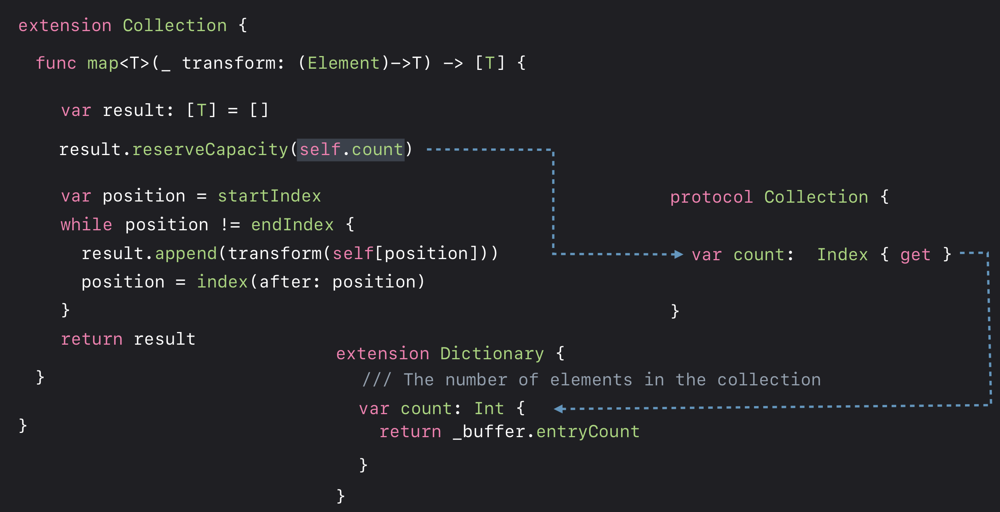

# Swift Generics

### Why Generics? 

스위프트에서 어떠한 다른 종류의 Type도 견딜 수 있는 유형인 Any 타입이 존재합니다. 

아래 코드는 Type에 관계없이 Buffer의 Element에 접근 가능해 보입니다.

```Swift
struct Buffer {
    var count: Int
    
    subscript(at: Int) -> Any {

    }
}
```
어느 시점에는 버퍼 안에 Element를 꺼내서 사용해야 합니다. 

아래 코드는 그러한 시나리오의 예제코드입니다.

```swift
var words: Buffer = ["song", "jong", "hoon"]

// I know this array contains strings
words[0] as? String

// oh my god!
words[0] = 42
```
항상 캐스팅해야하는 이런 코드는 짜증 날 뿐만 아니라, 잘못된 캐스팅으로 오류가 발생하기 쉽습니다. 

만약 문자열의 버퍼가 될 것으로 예상되는 것에 정수를 넣었다면 어떨까요? 

이 코드는 단지 사용 편의성에 관한 것만은 아닙니다. 

>메모리 표현
```
| Any(song) | Any(jong) | Any(hoon) |
```

우리가 만든 코드는 문자열의 버퍼를 원했을 수도 있지만, 컴파일러에게 그것을 알려줄 방법이 없습니다. 

그래서 타입의 유연성에 관심이 없음에도 불구하고 유연성에 대한 대가를 치르고 있습니다. 또한 모든 Type을 고려해야 하기 때문에 때때로 indirection을 사용해야 합니다.

그래서 우리는 이러한 문제들을 쉽게 사용하고 정확하게 하기 위함 뿐만 아니라 성능 문제도 해결하고 싶습니다. 

그리고 우리는 이런 문제를 해결하기 위해 **Parametric Polymorphism**이라고 부르는 기술을 사용합니다.

**한줄 요약: There's a lot of overhead in tracking, boxing, and unboxing the types in that Any.**


### Parametric Polymorphism

Parametric Polymorphism 스위프트에서 generics이라고 부르는 또 다른 용어입니다.

```Swift
struct Buffer<Element> {
    var count: Int
    
    subscript(at: Int) -> Element {
        
    }
}

var words: Buffer<String> = ["song", "jong", "hoon"]

// compiler know this array contains strings
words[0]

// compile error
words[0] = 42
```
Generics은 Element 타입을 컴파일 시점에 이미 가지고 있습니다. 즉, 버퍼에서 유형을 가져올 때 변환할 필요가 없습니다. 
만일 실수로 잘못된 종류의 타입을 할당하거나 혹은 그와 비슷한 문제가 보인다면, 컴파일러가 잡을 것입니다.
컴파일러는 버퍼에 포함된 Element Type에 대해 항상 정확한 지식을 가지고 있기 때문에 최적화 기회를 가질 수 있습니다.


### Designing a Protocol

Swift Standard Library에 있는 Collection Protocol을 단계적으로 구현해보며 내용을 이어 나가보겠습니다.

> Collection Protocol v1
```swift
protocol Collection {
    associatedtype Element
    
    var count: Int { get }
    subscript(at: Int) -> Element
}
```
Collection protocol을 따르는 모든 Type은 정수로 표시되는 요소의 지정된 위치를 가져올 수 있는 기능을 제공해야 합니다. Array와 같은 유형에 적합합니다. 

Collection Protocol v1 코드는 유연하다고 볼 수 있을까요?

Dictionary처럼 조금 더 복잡한 형태를 가진 것에 대해 생각해볼까요? 
```swift
extension Dictionary: Collection {
    private var _storage: HashBuffer<Element>
    
    struct Index {
        private let _offset: Int
    }
    
    subscript(at: Index) -> Element {
        return _storage[at._offset]
    }
}
```
Dictionary 타입은 offset에 꼭 1을 더하는 것을 원하지 않을 것 입니다. 왜냐하면 Dictionary는 순서가 보장되는 Collection이 아니기 때문입니다. 그렇기 때문에 Dictionary의 Index 타입은 Dictionary만이 제어할 수 있는 불투명한 타입이어야 합니다. 

Collection Protocol은 이전보다 더 유연한 모습으로 보입니다.

> Collection Protocol v2

```swift
protocol Collection {
    associatedtype Element
    associatedtype Index
    
    var count: Int { get }
    subscript(at: Index) -> Element
}
```

이번에는 Collection Protocol의 property인 count를 보겠습니다.

```swift
extension Collection where Index: Equatable {
    var count: Int {
        var i = 0
        var position = startIndex
        while position != endIndex {
            position = index(after: position)
            i += 1
        }
        return i
    }
}
```
동작은 너무 훌륭합니다. 이런 구현은 옳은 방법일까요? 

이런 방식의 where은 옳지 않습니다. 프로토콜은 사용하기 쉽게 디자인되어야합니다. 

하지만 이런 방법은 복잡하고 우리가 Index Type끼리 비교해야하는 코드를 작성해야 한다면, 우리는 항상 where 부분을 작성해야합니다. 

연관타입에 대한 제약 조건으로 프로토콜 제약으로 표현되는 것이 더 좋은 방법입니다.


>Collection Protocol v3
```swift
protocol Collection {
    associatedtype Element
    associatedtype Index: Equatable
    
    subscript(at: Index) -> Element

    func index(after: Index) -> Index
    
    var startIndex: Index { get }
    
    var endIndex: Index { get }
    
    var count: Int { get }
}
```


### Customization Points

하지만 Dictionany의 경우에는 아래와 같은 코드 작성이 더 좋은 성능을 보입니다 
원본 버전에 걸리는 선형적인 시간 O(n)이 였다면 이것은 O(1) 수준입니다.

```swift
extension Dictionary {
	private var _storage: HashBuffer<Element>
    
    var count: Int {
        return _storage.entryCount
    }
}
```

Swift Standard Library에 있는 map function을 보면 새로운 요소를 수용할 공간을 확보하기 위해 내부 스토리지를 재할당합니다.

```swift
func map<T>(_ transform: (Element) -> T) -> [T] {
    var result: [T] = []
    
    var position = startIndex
    while position != endIndex {
        result.append(transform(self[position]))
        position = index(after: position)
    }
    
    return result
}
```

위 코드는 크기에 따라 여러번 reallocation을 반복해야 합니다. 동적으로 메모리를 할당하는 것은 상당히 비쌀 수 있습니다.

이 구현을 통해 우리가 할 수 있는 멋진 최적화 기술이 있습니다. 우리는 그것이 얼마나 클지 이미 정확히 알고 있습니다. 원래 컬렉션과 크기가 똑같을 겁니다. 

그래서 우리는 그것에 추가를 시작하기 전에 앞에 배열된 정확한 양의 공간을 정확히 예약할 수 있었고, 그것은 좋은 속도를 가집니다. 
이렇게 하기 위해서, 우리는 count property를 사용하면 됩니다.

아래 코드는 최적화된 코드입니다.



Dictionary에 경우에는 count property의 기본 구현이 아닌 사용자 지정 구현을 사용하면 더 좋은 속도를 보입니다.

하지만 사용자 지정 구현은 런타임 성능에 작지만 0이 아닌 영향을 미칩니다. 따라서 사용자 지정이 필요한 경우에만 사용자 지정 추가하는 것이 좋습니다.


### Protocol Inheritance

Collection protocol이 제공하는 것 보다 더 많은 collection algorithms을 요구하는 경우가 생길수 있습니다.
예를 들면 Collection에서 특정 조건에 마지막 요소를 찾는 알고리즘이 필요하다고 가정해 봅시다.

우리는 Collection Protocol을 상속하여 아래 코드 처럼 구현 할 수 있습니다.

```Swift
protocol BidirectionalCollection: Collection {
    func index(before idx: Index) -> Index
    
    func lastIndex(where predicate: (Element) -> Bool) -> Index?
}

extension BidirectionalCollection {
    func lastIndex(where predicate: (Element) -> Bool) -> Index? {
        var position = endIndex
        
        while position != startIndex {
            position = index(before: position)
            if predicate(self[position]) {
                return position
            }
        }
        
        return nil
    }
}
```
bidirectionalCollection protocol 따르는 특정 Type은 Collection protocol 또한 따릅니다. 그리고 Collection protocol에 있는 알고리즘을 사용할 수 있습니다.

그렇다면 이번에는 element의 순서가 random한 순서를 보장하는 Shuffle Collection Protocol을 생각해 봅시다.

```swift
var array = [1, 2, 3, 4, 5, 6, 7, 8, 9, 10]
array.shuffle()
print(array) // [7, 5, 9, 6, 10, 8, 3, 1, 2, 4]

extension ShuffleCollection {
    mutating func shffile() {
        let n = count
        
        guard n > 1 else {
            return
        }
        
        for (i, pos) in indices.dropLast().enumerated() {
            let otherPos = index(startIndex, offsetBy: Int.random(in: i..<n))
            swapAt(pos, otherPos)
        }
    }
}
```

이렇게 Protocol을 만드는게 좋은 방법인지 생각해 봐야합니다.

우리는 이런 방식이 절대 좋은 방식이라고 생각하지 않습니다. 이것은 좋지 않은 패턴입니다. 이것은 단지 하나의 알고리즘을 설명하는 프로토콜로 보이고 이런 방식의 설계는 의미가 전혀 없는 프로토콜을 많이 만들어 냅니다.

우리는 shffile 을 이루는 개별 능력들을 주목해야합니다. 

shffile은 random access 그리고 mutation (swap)을 사용합니다. 이것을 분리하여 protocol로 작성할 수 있습니다.

```swift
protocol RandomAccessCollection: BidirectionalCollection {
    func index(_ position: Index, offsetBy n: Int) -> Index
    func distance(from start: Index, to end: Index) -> Int
}

protocol MutableCollection: Collection {
    subscript(index: Index) -> Element { get set }
    mutating func swapAt(_: Index, _: Index) { }
}

extension RandomAccessCollection where Self: MutableCollection {
    mutating func shuffle() {
        let n = count
        
        guard n > 1 else {
            return
        }
        
        for (i, pos) in indices.dropLast().enumerated() {
            let otherPos = index(startIndex, offsetBy: Int.random(in: i..<n))
            swapAt(pos, otherPos)
        }
    }
}
```

random access 측면이 있는 RandomAccessCollection protocol과 mutation의 측면이 있는 MutableCollection를 만들어 구성하였습니다.

이 때 RandomAccessCollection protocol을 따르는 object는 MutableCollection protocol 또한 준수하는 경우를 제약으로 하여 extension을 작성할 수 있습니다. **이렇게 하면 두가지 능력을 한군데 모을 수 있습니다.** 적합한 유형이 많고 일반적인 알고리즘이 많은 경우 프로토콜 계층 구조를 형성하는 경향이 있습니다. 이 계층은 너무 크거나 세분화되어서는 안됩니다.


계층을 올라가면서, 요구 사항이 더 적은 프로토콜로 이동하므로 이러한 요구 사항을 구현할 수 있는 Type이 더 많아 집니다. 
계층을 내려가면서, 계층 구조와 다른 프로토콜들을 조합함에 따라, 더 많고 복잡하고 전문화된 알고리즘을 구현할 수 있습니다.


### Conditional Conformance

조건부 적합성은 스위프트의 새로운 특징입니다.

아래 이미지를 먼저 보겠습니다.


Slice는 모든 Collection에 대해 특정 범위의 인덱스를 구독하여 해당 집합의 조각을 만들 수 있습니다. 그리고, 그 조각은 본질적으로 Collection의 일부를 보여 주는 것입니다. 

Collection을 자를 때 표시되는 기본 유형을 슬라이스라고 합니다. 슬라이스는 일반적인 어댑터 유형입니다. 

그래서 Collection을 가지고 있으며, 그것은 그 자체가 Collection입니다. 따라서 Collection에 대해 수행할 수 있는 모든 작업을 Slice에서 수행할 수 있습니다. (Protocol Inheritance)

그래서 우리는 Collection protocol func을 사용할 수 있습니다. 아래 코드는 가능하다는걸 보여줍니다.

```Swift
buffer.index(where { 0.isEven })
slice.index(where { 0.isEven })
```


만약 우리가 거꾸로 검색하는 BidirectionalCollection protocol의  lastIndex func를 사용하고 싶은 경우는 어떻게 해야할까요? 아래 처럼 작성하면 될까요?

```swift
buffer.lastIndex(where { 0.isEven })
slice.lastIndex(where { 0.isEven })
```

위 코드는 컴파일 에러를 보입니다. 만약 buffer BidirectionalCollection protocol을 따른다 할지라도 slice는 BidirectionalCollection protocol의 존재를 알지 못합니다.

우리는 이것을 가능하게 만들어 보려 합니다.

```swift
extension Slice: BidirectionalCollection where Base: BidirectionalCollection {
    func index(before idx: Index) -> Index {
        return base.index(before: idx)
    }
}

extension Slice: RandomAccessCollection where Base: RandomAccessCollection {
    func index(_ idx: Index, offsetBy n: Int) -> Index {
        return base.index(idx, offsetBy: n)
    }
    
    func distance(from s: Index, to e: Index) -> Int {
        return base.distance(from: s, to: e)
    }
}
```

Slice를 Extension하여 BidirectionalCollection프로토콜을 준수하도록 하겠습니다. 우리가 할 일은 이 Extension에 대한 제약사항을 추가하는 것입니다. **이것은 조건부 준수입니다.** Extension을 작성하고, 하나의 protocol을 준수하고, Extension이 무엇을 위한 것인지, 의미를 알 수 있도록 합니다. 이런 방식은 일반적으로 좋은 스위프트 스타일입니다. 


이제 또 standard library에 있는 다른 조건부 적합성의 적용을 살펴보겠습니다. 그것은 ranges입니다.

```swift
let doubleRange = 2.71828 ..< 3.14159
doubleRange.contains(3.0)

let intRange = 17 ..< 42
intRange.contains(25)

for i in intRange { ... }
```

어떤 Type의 Range들은 다른 것들보다 더 강력합니다.  intRange는 doubleRange와 다르게 요소를 반복할 수 있습니다. 

어째서 일까요? 그것은 intRange의 Type이 Collection protocol을 따르기 때문입니다.

실제로 그 내용은 아래 그림에 나타납니다. 


Swift4.2이전 버전에서는 integer range는 실제로 다른 유형을 얻게 됩니다. countableRange Type입니다. 

자, 이것은 구조적으로 Range 유형과 같습니다. 한가지 Type의 매개 변수가 있습니다.

 하위 및 상위 영역이 있지만 해당 바인딩 Type에 몇가지 요구 사항이 추가됩니다. 

그것은 Strideable Protcol입니다. 그 말은 모든 요소들을 열거할 수 있다는 뜻입니다. 


우리는 실제로 RandomAccessCollection Protocol을 따르게 함으로써 iteration loop를 사용하는  CountableRange를 만들 수 있습니다. 자, 그럼 기본 Range Type을 바꿔 봅시다.

```swift
extension Range: RandomAccessCollection where Bound: Strideable, Bound.Stride: SignedInteger {
    
}
```

RandomAccessCollection protocol을 준수하는 것은 자신이 상속하는 모든 protocol에 대한 준수를 의미합니다. 

하지만 이전의 Slice 예제에서 보는 것 처럼 **조건부 준수**에서는 계층의 다른 수준에 대해 다른 제약 조건을 가지고 있어야 합니다. 

컴파일러는 **조건부 준수**를 위한 적절한 제약 조건을 가지고 있는지 확인합니다. 이 경우 코드는 이렇게 바뀝니다.

```swift
extension Range: Collection, BidirectionalCollection, RandomAccessCollection where Bound: Strideable, Bound.Stride: SignedInteger {
    
}
```

이것은 이제  CountableRange가 하는 모든 것을 다 할 수 있습니다. 

그러면, 우리는 CountableRange를 어떻게 해야 할까요? 버릴 수도 있습니다.있습니다. 

실제로 CountableRange를 사용하는 코드가 많으므로 별칭으로 계속 사용할 수 있습니다. 이것은 정말 좋은 해결책입니다.

```swift
typealias CountableRange<Bound: Strideable> = Range<Bound> where Bound.Stride: SignedInteger
```


#### Generics and Classes

Swift에서는 superclass가 준수하는 protocol을 subclass 역시 준수 합니다.

```swift
class Vehicle: Drivable {
    
}

class PoliceCar: Vehicle {
    
} 

extension Drivable {
    func sundayDrive() {
        if Date().isSunday {
            drive()
        }
    }
}

PoliceCar().sundayDrive()
```

